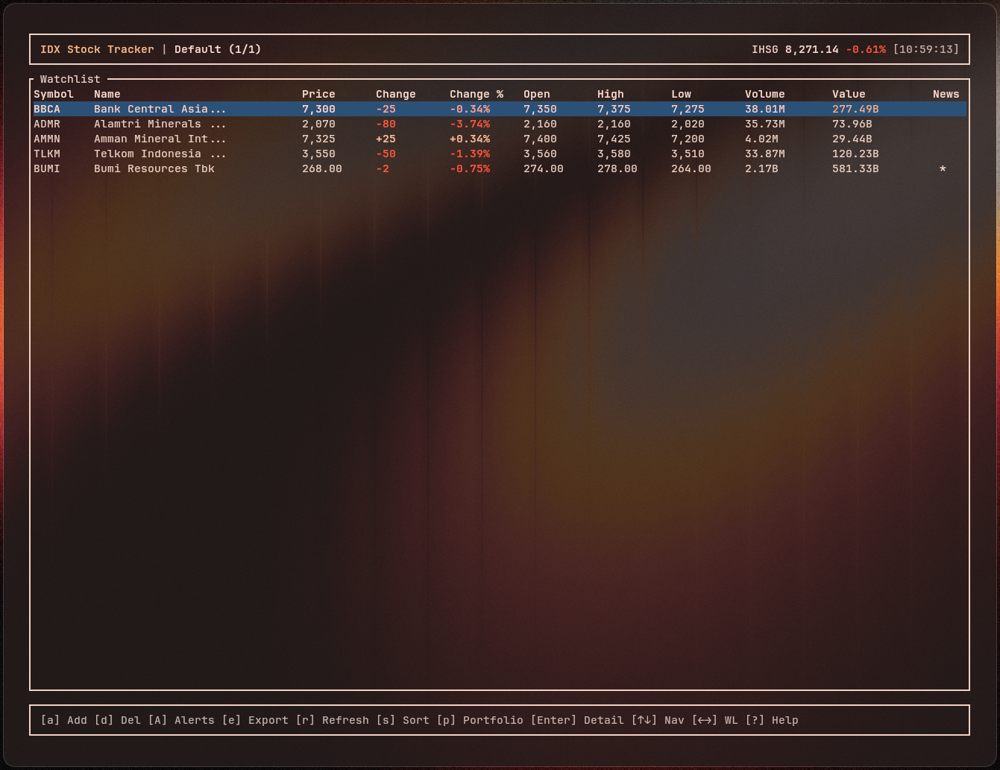

# idx-cli

A terminal UI (TUI) application for tracking Indonesian stock market (IDX) data.




## Features

- **Real-time stock quotes** from Yahoo Finance
- **Multiple watchlists** — organize stocks by category
- **Portfolio tracking** — track holdings with P/L calculations and allocation chart
- **RSS news feed** — aggregated financial headlines from Indonesian sources
- **Stock detail popup** — price, fundamentals, risk metrics, 3-month sparkline chart, and related news
- **Export** — save watchlist or portfolio data as CSV or JSON
- **Search & sort** — filter by symbol/headline and sort by any column

## Installation

```bash
# Clone the repository
git clone https://github.com/Einzigart/idx-cli.git
cd idx-cli

# Build and run
cargo build --release
./target/release/idx-cli
```

## Usage

```bash
# Run with default 1-second refresh interval
idx-cli

# Run with custom refresh interval (in seconds)
idx-cli -i 10
```

## Keybindings

| Key | Watchlist | Portfolio | News |
|-----|-----------|-----------|------|
| `p` | → Portfolio | → News | → Watchlist |
| `a` | Add stock | Add holding (step-by-step) | - |
| `d` | Delete selected | Delete selected | - |
| `e` | Export data | Edit holding | - |
| `r` | Refresh quotes | Refresh quotes | Refresh feeds |
| `Enter` | Stock detail | Stock detail | - |
| `j/k` or `↑/↓` | Navigate | Navigate | Navigate |
| `h/l` or `←/→` | Prev/Next watchlist | - | - |
| `n` | New watchlist | - | - |
| `R` | Rename watchlist | - | - |
| `D` | Delete watchlist | - | - |
| `s` | Cycle sort column | Cycle sort column | Cycle sort column |
| `S` | Toggle sort direction | Toggle sort direction | Toggle sort direction |
| `/` | Search symbols | Search symbols | Search headlines |
| `c` | - | Allocation chart | - |
| `?` | Help | Help | Help |
| `q` | Quit | Quit | Quit |

## Configuration

Configuration is stored at `~/.config/idx-cli/config.json` and includes:
- Watchlists with stock symbols
- Portfolio holdings (symbol, lots, average price)
- RSS news source URLs

## License

MIT
